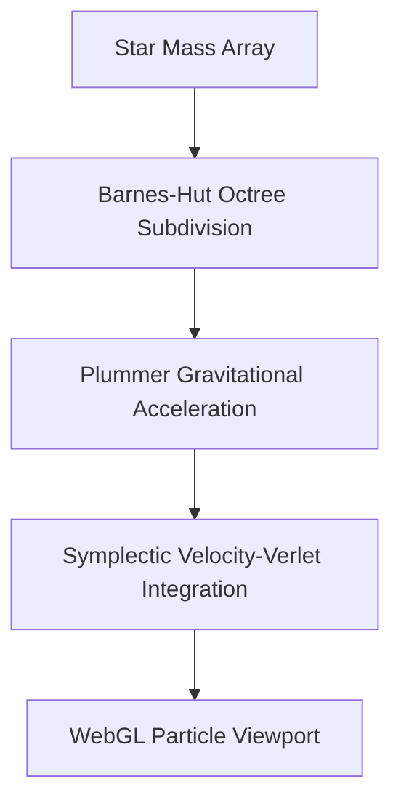

# StarCluster — System Architecture & Physics Specification

## 1. N-Body Numerical Integrator Pipeline
StarCluster computes gravitational acceleration between 10,000 particle masses using a Plummer potential:

$$\mathbf{a}_i = -G \sum_{j \neq i} \frac{m_j (\mathbf{r}_i - \mathbf{r}_j)}{\left( |\mathbf{r}_i - \mathbf{r}_j|^2 + \epsilon^2 \right)^{3/2}}$$

## 2. Dual Authorship
- **Жирняк (Jirnyak)** — Lead Astrophysical Physicist & Core Engine.
- **Адольф Петушков (Adolf Petushkov)** — High-Concurrency Architecture & Simulation Pipeline.
