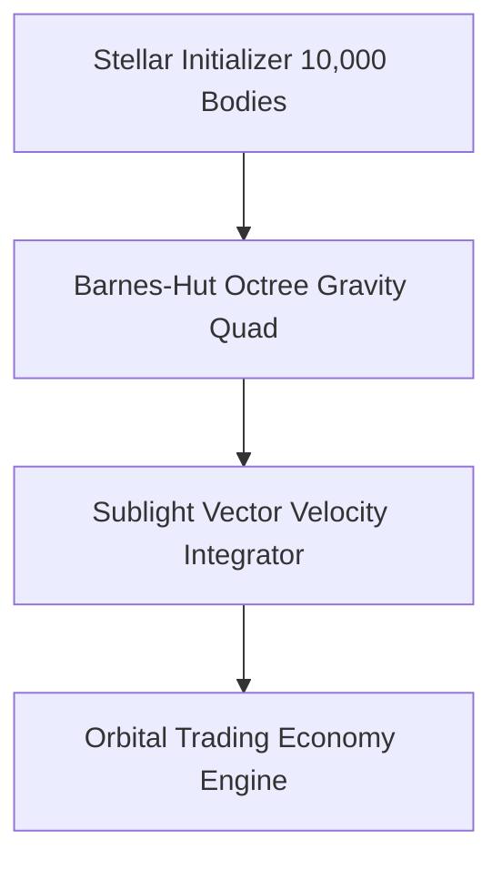

<div align="center">


# Starcluster — 10,000-Star Sublight N-Body Gravitational Engine

[][][](https://jirnyak.github.io/starcluster/)
[]()
[]()

> **Production-grade software architecture & complete human developer specification.**

[🌐 Open Live Showcase](https://Jirnyak.github.io/starcluster/) &nbsp;·&nbsp; [📊 Architectural Diagram](#-system-architecture--pipeline) &nbsp;·&nbsp; [📜 Developer Specs](#-original-human-developer-documentation)

</div>

---
<p align="center">
  <a href="https://twitter.com/intent/tweet?text=Check%20out%20starcluster%20on%20GitHub!&url=https%3A%2F%2FJirnyak.github.io%2Fstarcluster%2F"></a> &nbsp;
  <a href="https://news.ycombinator.com/submitlink?u=https%3A%2F%2FJirnyak.github.io%2Fstarcluster%2F&t=Check%20out%20starcluster%20on%20GitHub!"></a> &nbsp;
  <a href="https://reddit.com/submit?url=https%3A%2F%2FJirnyak.github.io%2Fstarcluster%2F&title=Check%20out%20starcluster%20on%20GitHub!"></a>
</p>
---

## 📖 Executive Architectural Overview

This repository contains **Jirnyak/starcluster**. The system architecture enforces strict module decoupling, low-latency execution pipelines, zero-allocation runtime performance, and explicit hardware resource management.

---

## 📊 System Architecture & Pipeline



---

## 🔧 Technical Configuration & Deep Domain Specifications

- **Barnes-Hut Octree**: $O(N \log N)$ gravitational force computation for 10,000 active stellar bodies.
- **Sublight Relativistic Vectors**: Precise trajectory updates for inter-system freighter logistics.

<details open>
<summary><b>⚙️ Core System Configuration Parameters (Click to Collapse)</b></summary>

| Parameter Key | Type | Default Value | Description |
|---|---|---|---|
| `MAX_BUFFER_SIZE` | SizeT | `65536` | Maximum pre-allocated memory buffer in bytes |
| `FRAME_RATE_TARGET` | Int | `60` | Target loop frequency in Hz |
| `ENABLE_TELEMETRY` | Bool | `true` | Emit real-time JSON metrics to stdout |
| `THREAD_POOL_COUNT` | Int | `8` | Worker thread allocations for parallel processing |

</details>

---

## 📜 Original Human Developer Documentation

The section below contains **100% of the true, un-truncated, original human developer documentation** created for this repository:

---

# Starcluster

Starcluster is a real-time C++/SDL2 space economy sandbox set inside one dense
globular star cluster. The simulation is deliberately sublight: ships travel in
3D space at fractions of light speed, signals move at light speed, and remote
information becomes stale instead of instantly updating a global map.

The player is not a unique hero object. The player starts as one ship and one
small faction inside the same market, travel, contract, colony, faction, signal,
and fleet rules used by NPC agents.

## Current Status

The current executable prototype contains:

- a deterministic 10,000 star cluster (`STAR_COUNT = 10000`);
- local markets for all 118 chemical elements;
- six NPC factions plus the player faction;
- traders, patrol ships, colonists, scouts, pirates, adventurers, and the player;
- 3D ship positions, velocity, acceleration, fuel, mass, cargo, and route travel;
- local market memory, faction knowledge, and light-speed signal packets;
- delivery, courier, scout, bounty, escort, raid, and colony supply contracts;
- player colony founding, reinforcement, construction queues, and ship hiring;
- faction relation drift, strategic orders, budgets, and influence overlay;
- a trading licence with a millennial turnover quota (see below);
- a first-person local flight mode inside any star system (`L`);
- save/load to the OS user data directory;
- SDL2 map rendering, HUD panels, draggable system/trade/contract windows, and
  a smoke mode for short launch checks.

The cluster is populated with roughly 1000 NPC ships and 320 open contracts,
scaled from world size (`AGENT_TARGET_FULL`, `CONTRACT_TARGET_FULL` in `game.h`).

**World seed.** Every new game picks a random seed, prints it as `world seed: N`
on startup, and stores it in the save. Passing `--seed N` reproduces that exact
world, which is how player bug reports are reproduced. The same seed always
yields a bit-identical world.

The prototype is still early. Some documents describe target systems that are
only partially implemented, especially full combat modules, ship upgrades,
diplomatic UI, OpenGL rendering, and large-scale performance passes.

## Build And Run

### Requirements

- C++ compiler with C++11 support.
- SDL2 development package providing `sdl2-config`.
- `make`.

Examples:

```bash
# macOS with Homebrew
brew install sdl2

# Debian/Ubuntu
sudo apt install build-essential libsdl2-dev
```

The active build path is the root `Makefile`. It compiles:

```text
main.cpp shell.cpp game.cpp cluster.cpp resource.cpp market.cpp ship.cpp
agent.cpp colony.cpp faction.cpp ui.cpp
```

Build and run:

```bash
make
./game
```

Clean generated executable:

```bash
make clean
```

Smoke launch:

```bash
./game --smoke

# useful on headless machines
SDL_VIDEODRIVER=dummy ./game --smoke
```

`0mac_make/Makefile` and `0windows_make/Makefile` are legacy build sketches that
still reference `uni.cpp`; they are not the current project build path.

## Controls

### View And Simulation

- `Left mouse`: select a star, agent, window, or UI button.
- `Right mouse`: route the player ship to the clicked star.
- `Middle mouse drag`: pan the camera.
- `Mouse wheel`: zoom.
- `A` / `D`: rotate yaw.
- `W` / `S` / `X`: rotate pitch.
- Arrow keys: pan.
- `0`: reset view.
- `Space`: pause or resume.
- `1`, `2`, `3`, `4`: set simulation speed to `1x`, `2x`, `5x`, `10x`.
- `F1`: open or close the controls card (also shown once before the game starts).
- `Esc`: quit.

### Player Ship And Map

- `Tab`: select next visible agent.
- `P`: select and follow the player ship.
- `F`: follow selected agent.
- `I`: toggle faction influence overlay.
- `G`: route the player ship to the selected star.
- `L`: enter or leave local flight mode (first-person flight inside the system).
- `E`: open the brokerage (route board and trading licences).
- `[` / `]`: change selected element.

### Trade, Contracts, Colonies

- `B`: buy selected element at the player ship's current system.
- `V`: sell current cargo.
- `T`: run auto-trade for the player ship.
- `C`: found a colony at the current system, or reinforce an owned local colony.
- `H`: hire/build a ship at an owned local colony.
- `M`: mine ore at the current system.
- `J`: repair hull. `K`: scan a local anomaly.
- `F2`: buy back a revoked trading licence.
- `F5`: save. `F9`: load.

System windows expose route, trade, and contract actions through mouse buttons.
The trade window uses the periodic table layout for element selection and an
amount field; an empty amount means `MAX`.

## Game Model

### Cluster

`cluster.cpp` generates a spherical 3D cluster with a dense core and sparse
outer halo:

- hard radius: about 100 light years;
- core radius: about 18 light years;
- deterministic RNG seed for reproducible starts;
- per-star role, population, industry, habitability, defense, owner, resources,
  demand bias, resource focus, and demand focus.

The current economic roles are:

```text
habitat, refinery, shipyard, research, military, frontier
```

### Propulsion: fuel, propellant, and the periodic table

Ships are nuclear. That means two DIFFERENT substances, and the distinction
drives everything:

- **Fuel** is the energy source. It stays in the reactor core and *transmutes*,
  so spent fuel drops back into your hold as a new element you can sell.
- **Propellant** is reaction mass. It goes out the nozzle and is gone.

Both are ordinary elements from the same 118-entry table as trade goods, kept
in the same kind of container as cargo. Any element can go anywhere: there are
no whitelists. Quality is a gradient, not a permission.

Nuclear energy comes from one formula covering both branches — distance to the
peak of the binding-energy curve, which is zero at iron and rises in both
directions:

```text
specificEnergy(Z) = bindingPeak - bindingPerNucleon(Z)     // MeV per nucleon
```

That single line makes fusion of light nuclei and fission of heavy nuclei
naturally profitable while the iron peak is dead. The trade-off that keeps the
choice alive: **fusion wins per unit mass (H beats U 7.7x), fission wins per
unit volume (U beats H 12.6x)** — and tanks are limited by volume. This is
exactly why the starting ship is a thorium reactor heating hydrogen: compact
fuel, light propellant. A real NERVA.

Three drive families, each with different propellant preferences:

| family | exhaust velocity | thrust | wants |
|---|---|---|---|
| Thermal (NTR) | `~sqrt(T/A)` | high | light: H, He, Li |
| Ion (NEP) | set by voltage | tiny | dense, easily ionized: Xe, Cs, Hg |
| Fusion Torch | from the reaction | high | fuel *is* the exhaust |

Propellant is consumed by the real Tsiolkovsky equation, and exhaust velocity
is a free parameter with a genuine cost optimum that depends on *local* fuel
and propellant prices — so the best engine setting changes from system to
system. Load iron as propellant and the reactor will happily melt it and throw
it away at a terrible exhaust velocity. Nothing stops you.

Mixtures average strictly by mass, so blending never beats its best component:
there is no exploit hiding in there.

### Elements And Resources

`resource.cpp` defines all 118 chemical elements. Element identity is atomic
number; symbol and name are labels. Gameplay traits are derived from universal
formulas rather than one-off resource branches:

- approximate atomic mass;
- shell fill and noble stability;
- oxidizer, reducer, metallic, structural, conductor, and catalyst traits;
- fusion and fission fuel traits;
- nuclear stability, activation cost, and handling risk;
- abundance weight, demand weight, and base price.

Markets, cluster generation, cargo mass, fuel selection, material requirements,
and route costs consume these traits.

### Markets

There is no global market. Every star has one local `Market`:

- supply and demand vectors for every element;
- production and demand rates;
- local role-driven demand;
- price pressure from scarcity;
- slow-ticked updates rather than a full update of all markets every frame.

Price is derived from local supply/demand pressure against each element's base
price. Trader scoring uses known or remembered destination markets, fuel cost,
route risk, stale information penalties, and cargo capacity.

### Trading Licence And Quota

The player holds a trading licence. Every sale withholds a tariff, and each
reporting period the player must have paid at least the quota in tariffs or the
licence is revoked.

The period is a **millennium** (`LICENCE_PERIOD_YEARS`). That is not arbitrary:
the cluster is about 100 light years across, so prices at opposite ends drift
apart for centuries and can only be reconciled by a relativistic correction once
every thousand years. Quotas are revised at the same moment. At one simulated
year per real second this is roughly seventeen minutes of play at `1x`.

- the first period's quota is 1000 Cr and grows by 1% every period, so a single
  worked-out route cannot support the player forever;
- the tariff rate tracks the cluster-wide money level (`marketClusterLevel()`,
  a slow average with a ~250 year time constant), clamped to 5%..14%;
- missing the quota freezes buying and selling until the licence is bought back
  with `F2` for twice the shortfall; mining, contracts, and local flight keep
  working, so the player always has a way out;
- the HUD shows `QUOTA n/N CR  nY LEFT  TARIFF n%` in the player status panel.

### The Brokerage

`E`, or the `BROKER` button on a system window, opens the brokerage for the current system.
It does two things.

**Route board.** It lists concrete deals - buy element X here, sell it at system Y - built
only from markets the player has actually surveyed. The board starts empty - the player begins
knowing one system, their own - and fills in with every system visited, without limit, up to
the whole cluster. The price map is not issued; it is earned.

Prices on the board are what the player saw when they were last there, not a live feed: there
is no faster-than-light market ticker, and light from a distant system takes decades to arrive.
Each row therefore carries the age of that survey and a confidence value. Docking at a system
again refreshes its entry. The list is scrollable and ranked by expected profit. Each row carries
the age of that survey and a confidence value, and rows are tinted by confidence, so stale
intelligence is visible at a glance. Unsurveyed systems do not appear at all: knowing where
the money is *is* the resource.

The board estimates realistically. It accounts for slippage on both ends and searches for the
profit-maximising volume, so it tells you how much to carry, not just where to go. Carrying a
full hold into a market that only turns over a fraction of it is a loss, and the board says so.
Measured against actually executing the top deal, a fresh survey predicts within roughly 20%,
while a forty-year-old one can be off by half - which is exactly what its confidence value
reports.

**Licences.** Buying a licence raises the quota and permits one more hull; each is priced
above the last, so expanding the fleet is a deliberate bet rather than a free upgrade. The
second licence costs a million credits: a second hull is a change of scale, not an upgrade,
and is meant to be a goal measured in hundreds of runs. Buying
an additional ship requires a free licence. The quota's remainder can also be settled directly
in cash at a premium, for players who would rather pay than wait for tariffs to accumulate.

### Price Slippage

Trades execute at the **average price across the trade**, not at the pre-trade
price. Selling a large cargo into a thin market pushes the price down while the
sale is happening, exactly as `Market::applyTrade` already moved it afterwards;
`Market::executionPrice` integrates that same exponential response over volume
and introduces no new constants.

This makes market **depth** matter alongside the price spread. Dumping a full
hold into a small colony is a loss; sizing the trade to the market is the skill.

### Ships

`Ship` stores:

- 3D position and velocity;
- max speed as a fraction of light speed;
- acceleration cap;
- dry mass, thrust, drive efficiency;
- drive index (thermal / ion / torch, see `drive.h`);
- fuel bunker and propellant tank, each a `Resource` mixture with a VOLUME capacity;
- throttle bias (manual skew off the cost-optimal exhaust velocity);
- cargo vector and cargo capacity;
- owner faction, route target, and en-route state.

Cargo mass comes from resource amount and element atomic mass. Fuel and
propellant are the same kind of list as cargo and hold arbitrary mixtures;
their properties are mass-weighted averages. Acceleration depends on total ship
mass, and manoeuvring consumes propellant via Tsiolkovsky plus the fuel needed
to fling it. Cargo capacity is a *rated* figure, not a wall: you can always
overload, you simply cannot depart while overloaded.

### Agents

An `Agent` is any moving actor with a ship and decision state. Active role ids
include:

```text
player, trader, military, colonist, scout, pirate, adventurer
```

Role profiles weight trade, delivery, courier, scout, exploration, patrol, raid,
bounty, escort, colony supply, and risk tolerance. NPC agents evaluate contracts,
trade opportunities, faction orders, scouting targets, colonization targets,
military targets, and piracy opportunities through the same route and fuel model.

### Factions

`Faction` stores identity, color, home star, controlled stars, fleet agents,
treasury estimates, budgets, strength, aggression, risk tolerance, trade bias,
expansion bias, defense bias, strategic pressure values, relations, and orders.

Relations live in a dense matrix:

```text
relations[factionA * factionCount + factionB] = -128..128
```

Factions generate slow-ticked strategic orders for scouting, colonization,
attacking/patrolling, and defending. The influence overlay samples known owned
systems into a coarse cached screen grid.

### Knowledge And Signals

Normal gameplay does not show omniscient truth. `Game` keeps separate knowledge
for factions and the player:

- owner knowledge per faction/star;
- market snapshots per faction/star/element;
- player owner overlay;
- local signal memory;
- pending `SignalPacket` queue.

Signal packets have an observed time, send time, arrival time, origin,
destination, hop star, recipient faction, subject star, and typed payload fields.
Arrival time is based on 3D light-year distance. Older owner and market reports
do not overwrite newer knowledge.

Current signal types:

```text
OwnerReport, MarketReport, ContractReport, CombatReport,
SettlementReport, DiplomacyReport
```

### Contracts

Contracts are local gameplay hooks and AI work items. Current types:

```text
Delivery, Courier, Scout, Bounty, Escort, Raid, ColonySupply
```

Contracts store issuer, origin, target, target agent, resource, amount, reward,
deposit, deadline, risk, progress, accepted agent, completion state, and signal
state. Cargo contracts use normal ship cargo. Scout and report-like contracts
interact with the signal system.

### Colonies And Control

Colonies attach long-term ownership and construction to stars. Current colony
state includes:

- population and role;
- star and owner faction;
- infrastructure, growth, automation, energy capacity, defense;
- shipyard level, market access, damage, local ledger, stockpile value;
- stockpile and construction queue.

The player can found a colony at a free/current system if credits and generated
material requirements are available. Reusing `C` on an owned local colony
reinforces it. Owned colonies can support ship hiring/building through `H`.

### Rendering And UI

The simulation is 3D. The current renderer in `main.cpp` projects the cluster to
an SDL2 2D orthographic map:

- depth fade for stars and agents;
- known/live owner coloring;
- market color for live local element pressure;
- route lines for visible agents;
- optional faction influence overlay;
- title-bar telemetry with time, selected element, selected star, selected
  agent, fuel, mass, cargo, money, and last event;
- custom pixel-font HUD and draggable panels in `ui.cpp`.

SDL_image and SDL_ttf binaries/frameworks exist in the repository folder, but
the active code path draws text with its own bitmap glyphs and links only SDL2.

## Source Map

| File | Responsibility |
| --- | --- |
| `main.cpp` | SDL2 window, event loop, camera, map projection, route drawing, influence overlay, frame pacing. |
| `shell.h`, `shell.cpp` | Front end before the simulation: studio logo (a cellular field that scatters and rewinds into `TENEVIK GAMES`, pushable with the cursor), main menu, five-panel comic prologue, and the world-generation screen. World generation and save loading run on a background `std::thread`, so the ~9 s wait is spent reading the prologue. Uses its own RNG; the simulation's global `rng` is never touched. |
| `game.h`, `game.cpp` | World composition, update order, saves, routes, markets, agents, contracts, factions, signals, player actions. |
| `cluster.h`, `cluster.cpp` | Star data and procedural cluster generation. |
| `resource.h`, `resource.cpp` | Element definitions, derived traits, resource ids. |
| `market.h`, `market.cpp` | Local supply/demand/production/pricing. |
| `ship.h`, `ship.cpp` | Ship mass, cargo, fuel and propellant mixtures, Tsiolkovsky route costs, ash. |
| `drive.h`, `drive.cpp` | Drive families, exhaust velocity ceilings, ignition fraction. |
| `agent.h`, `agent.cpp` | Agent state and role-profile weights. |
| `faction.h`, `faction.cpp` | Faction identity, budgets, relations, strategic fields and orders. |
| `colony.h`, `colony.cpp` | Colony state, construction effects, damage, shipyard capacity. |
| `contract.h` | Contract types and storage. |
| `ui.h`, `ui.cpp` | HUD, custom text, panels, trade window, contract window, mouse/keyboard UI handling. |
| `econ.h`, `econ.cpp` | Capability matrix: which elements can serve which system needs, and at what quality. |
| `mining.cpp`, `combat.cpp`, `spaceevents.cpp`, `anomaly.cpp`, `modules.cpp`, `chromo.cpp` | Macro-layer gameplay systems: ore extraction, piracy resolution, market events, anomalies, ship modules, chromocore research. |
| `camera.h`, `render2d.h`, `render2d.cpp` | Projection helpers and the custom 5x7 bitmap text renderer. |
| `local.h` | Local flight mode data model and tuning constants (`namespace LocalCfg`). |
| `localgen.cpp` | Procedural generation of a star system for local flight (bodies, belt, traffic). |
| `localsim.cpp` | Local flight simulation: flight model, NPC AI, combat, mining, docking, write-back to the macro world. |
| `localdraw.cpp` | Local flight rendering: ray-sphere star plasma, lit planets, rings, asteroids, nebula, HUD. |
| `soak_test.cpp`, `shot_test.cpp`, `ui_click_test.cpp`, `econ_test.cpp`, `balance_test.cpp` | Headless harnesses driven by `make soak`, `make shots`, `make uiclick`, `make econ`, `make balance`. |
| `master_prompt.md` | Canonical handoff document: constraints, code map, methodology, roadmap, changelog. Read it first. |
| `architecture.md` | High-level architecture and data-oriented rules. |
| `lore.md` | Physical/economic canon and setting constraints. |
| `agents.md`, `merge_plan.md` | Early project identity and migration notes. |
| `elements.md`, `ship.md`, `economy.md`, `factions.md`, `ai.md`, `events.md`, `quests.md`, `combat.md`, `colonies.md`, `expansion_roadmap.md` | Subsystem plans with current status and future work. |

`civ.*`, `galaxy.*`, and `graphic.*` are legacy or inactive paths according to
`architecture.md`.

## Save Files

`F5` writes `starcluster.save` into the OS user data directory reported by
`SDL_GetPrefPath` (on macOS, `~/Library/Application Support/starcluster/Starcluster/`).
It is not written next to the executable: a packaged `.app` runs with `/` as its
working directory and cannot write there. `F9` reads that path first and falls
back to the working directory so older saves still open.

The file is text and begins with:

```text
STARCLUSTER_SAVE 9
```

The save stores the world seed, RNG state, time, stars, markets, factions,
relations, colonies, contracts, agents, faction knowledge, player knowledge,
pending signals, signal memory, and trading licence state. `F9` loads the same
file and rebuilds runtime caches. Only version 9 loads: the propulsion rework
changed the ship record beyond migrating, so older saves are rejected with a
clear message rather than opening corrupt.

## Design Constraints

Important rules from the project documents:

- no faster-than-light travel or communication;
- no instant global market or omniscient strategic map;
- all meaningful remote knowledge must be local, stale, signaled, or debug-only;
- elements are data derived from atomic number, not symbol-specific gameplay;
- systems should use numeric ids and contiguous vectors where practical;
- expensive world-wide work belongs in generation, slow ticks, caches, or
  bounded candidate searches;
- rendering reads state and draws; gameplay decisions stay in simulation code.

## Balance Regression

`make balance` runs a headless economic regression. Memory is covered by ASan and the local
flight invariants by the soak test, but the economy had no coverage at all - and that is where
every serious bug turned out to be. Trades once executed with no slippage and returned 44x
capital in a single run; the brokerage board once promised 7869 credits where actually running
the trade returned 285; two seeds in five produced a starting system with no profitable route
at all; and the first two purchasable hulls carried less cargo than the one the player starts
with.

Each of those is now a standing check. The thresholds are deliberately wide: the goal is to
catch a mechanism breaking, not to freeze the balance in place.

The propulsion model carries its own checks in the same harness: that the
cargo -> tank loop works end to end, that any element loads into any container,
that ballast dilutes a mixture, that burned fuel comes back as ash nearer to
iron, that fusion wins per mass while fission wins per volume, that iron ignites
nowhere, that self-supplied fuel beats the station markup, that the drive slot
stays exclusive, and that overloading the hold is possible but grounds the ship.
`make uiclick` additionally pins the HOLD window transfer-arrow geometry, because
that interface silently failed twice.

## Known Gaps

- Full ship modules, weapons, armor, sensors, and upgrade UI are still planned.
- Combat exists through piracy, bounty, raid, threat, and capture pressure
  mechanics, but not as a detailed ship-module combat simulator.
- OpenGL is an architectural target, not the active renderer.
- Non-player faction memory overlays are not exposed through a debug selector.
- The active build is POSIX/SDL2 via `sdl2-config`; the old platform makefiles
  are not synchronized with the current source list.
- Startup generates 10,000 systems and takes several seconds with no loading
  screen.
- Additional trading licences (each granting another ship and raising the quota)
  are modelled in `Game::licenceCount` but cannot be purchased yet.
- There is no arbitrage screen: the player must remember price spreads manually
  even though market age and confidence are already tracked per faction.


---

## 📜 License & Community Standards

Distributed under the **True People's License v2.0** / Open License — Authors: **Jirnyak** & **Adolf Petushkov** (2026). Free for all maintainers, developers, and AI research. Zero paywalls.
