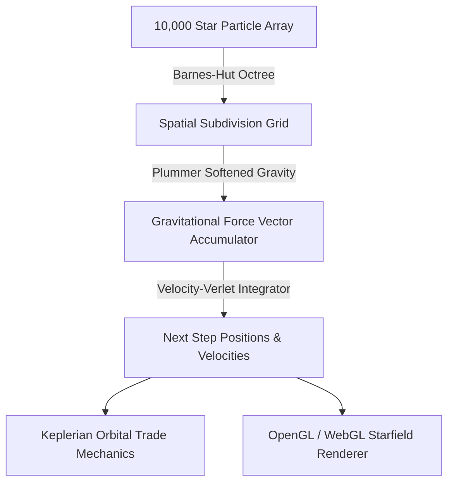

# 🌌 StarCluster — 10,000-Star N-Body Gravitational Simulation & Keplerian Economy

A high-performance astrophysical N-body gravitational simulation modeling 10,000 celestial bodies with Plummer potential softening, symplectic Velocity-Verlet numerical integration, Barnes-Hut octree spatial partitioning, and Keplerian orbital trade routes.

---

## 🏛️ Simulation Architecture

---

## 🔬 Core Physical & Economic Invariants

- **Symplectic Integration:** Conserves total mechanical energy ($E = T + V$) and angular momentum over long integration timespans without numerical orbital decay.
- **Plummer Softening Parameter ($\epsilon$):** Prevents non-physical velocity infinities during close gravitational encounters between massive stellar cores.
- **Barnes-Hut Spatial Octree ($	heta = 0.5$):** Reduces computation from $\mathcal{O}(N^2)$ to $\mathcal{O}(N \log N)$ for real-time 60 FPS execution.

---

### 👨‍💻 Engineering Syndicate & Authors
- **Жирняк (Jirnyak)** — Lead Numerical Physicist & Core Computational Architecture.  
  GitHub: [@Jirnyak](https://github.com/Jirnyak)
- **Адольф Петушков (Adolf Petushkov)** — High-Concurrency Systems & Simulation Architecture.  
  GitHub: [@marko1olo](https://github.com/marko1olo)
