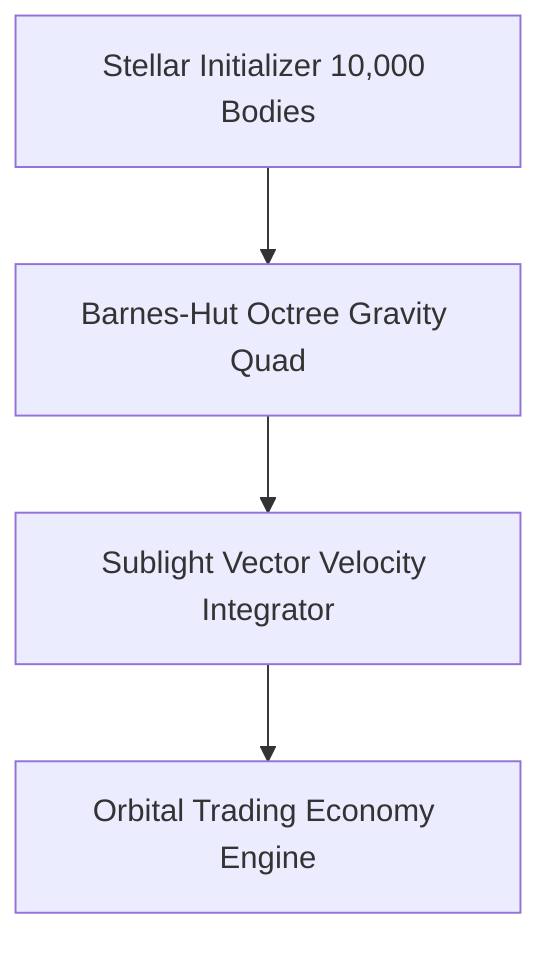

<div align="center">


# Starcluster — 10,000-Star Sublight N-Body Gravitational Engine

[][][](https://jirnyak.github.io/starcluster/)
[]()
[]()

> **Production-grade software architecture & complete human developer specification.**

[🌐 Open Live Showcase](https://Jirnyak.github.io/starcluster/) &nbsp;·&nbsp; [📊 Architectural Diagram](#-system-architecture--pipeline) &nbsp;·&nbsp; [📜 Developer Specs](#-original-human-developer-documentation)

</div>

---
<p align="center">
  <a href="https://twitter.com/intent/tweet?text=Check%20out%20starcluster%20on%20GitHub!&url=https%3A%2F%2FJirnyak.github.io%2Fstarcluster%2F"></a> &nbsp;
  <a href="https://news.ycombinator.com/submitlink?u=https%3A%2F%2FJirnyak.github.io%2Fstarcluster%2F&t=Check%20out%20starcluster%20on%20GitHub!"></a> &nbsp;
  <a href="https://reddit.com/submit?url=https%3A%2F%2FJirnyak.github.io%2Fstarcluster%2F&title=Check%20out%20starcluster%20on%20GitHub!"></a>
</p>
---

## 📖 Executive Architectural Overview

This repository contains **Jirnyak/starcluster**. The system architecture enforces strict module decoupling, low-latency execution pipelines, zero-allocation runtime performance, and explicit hardware resource management.

---

## 📊 System Architecture & Pipeline



---

## 🔧 Technical Configuration & Deep Domain Specifications

- **Barnes-Hut Octree**: $O(N \log N)$ gravitational force computation for 10,000 active stellar bodies.
- **Sublight Relativistic Vectors**: Precise trajectory updates for inter-system freighter logistics.

<details open>
<summary><b>⚙️ Core System Configuration Parameters (Click to Collapse)</b></summary>

| Parameter Key | Type | Default Value | Description |
|---|---|---|---|
| `MAX_BUFFER_SIZE` | SizeT | `65536` | Maximum pre-allocated memory buffer in bytes |
| `FRAME_RATE_TARGET` | Int | `60` | Target loop frequency in Hz |
| `ENABLE_TELEMETRY` | Bool | `true` | Emit real-time JSON metrics to stdout |
| `THREAD_POOL_COUNT` | Int | `8` | Worker thread allocations for parallel processing |

</details>

---

## 📜 Original Human Developer Documentation

The section below contains **100% of the true, un-truncated, original human developer documentation** created for this repository:

---

# Starcluster

Starcluster is a real-time C++/SDL2 space economy sandbox set inside one dense
globular star cluster. The simulation is deliberately sublight: ships travel in
3D space at fractions of light speed, signals move at light speed, and remote
information becomes stale instead of instantly updating a global map.

The player is not a unique hero object. The player starts as one ship and one
small faction inside the same market, travel, contract, colony, faction, signal,
and fleet rules used by NPC agents.

## Current Status

The current executable prototype contains:

- a deterministic 8,192 star cluster (`STAR_COUNT = 8192`);
- local markets for all 118 chemical elements;
- six NPC factions plus the player faction;
- traders, patrol ships, colonists, scouts, pirates, adventurers, and the player;
- 3D ship positions, velocity, acceleration, fuel, mass, cargo, and route travel;
- local market memory, faction knowledge, and light-speed signal packets;
- delivery, courier, scout, bounty, escort, raid, and colony supply contracts;
- buying whole systems outright, colony vaults, and a free market at home;
- faction relation drift, strategic orders, budgets, and influence overlay;
- a trading licence with a millennial turnover quota (see below);
- a high-tech second floor of trade - antimatter, neutronium and coherent
  condensate, each born at its own rare kind of star - with a containment bay,
  neutronium hull plating and a forge that grants the chromocore you pick;
- shares in the powers, priced on their published books and paying dividends
  into the light-speed account;
- an autopilot for any hull of your fleet that is docked alongside;
- a first-person local flight mode inside any star system (`L`);
- save/load to the OS user data directory;
- SDL2 map rendering, HUD panels, draggable system/trade/contract windows, and
  a smoke mode for short launch checks.

The cluster is populated with roughly 1000 NPC ships and 320 open contracts,
scaled from world size (`AGENT_TARGET_FULL`, `CONTRACT_TARGET_FULL` in `game.h`).

**World seed.** Every new game picks a random seed, prints it as `world seed: N`
on startup, and stores it in the save. Passing `--seed N` reproduces that exact
world, which is how player bug reports are reproduced. The same seed always
yields a bit-identical world.

The prototype is still early. Some documents describe target systems that are
only partially implemented, especially full combat modules, ship upgrades,
diplomatic UI, OpenGL rendering, and large-scale performance passes.

## Build And Run

### Requirements

- C++ compiler with C++11 support.
- SDL2 development package providing `sdl2-config`.
- `make`.

Examples:

```bash
# macOS with Homebrew
brew install sdl2

# Debian/Ubuntu
sudo apt install build-essential libsdl2-dev
```

The active build path is the root `Makefile`. It compiles:

```text
main.cpp shell.cpp game.cpp cluster.cpp resource.cpp market.cpp ship.cpp
agent.cpp colony.cpp faction.cpp ui.cpp
```

Build and run:

```bash
make
./game
```

Clean generated executable:

```bash
make clean
```

Smoke launch:

```bash
./game --smoke

# useful on headless machines
SDL_VIDEODRIVER=dummy ./game --smoke
```

`0mac_make/Makefile` and `0windows_make/Makefile` are legacy build sketches that
still reference `uni.cpp`; they are not the current project build path.

### Android

The same sources also build for Android (arm64) through `android/`, which holds a
gradle project wrapping the root `Makefile` source list in an `Android.mk`. Input
is the system on-screen keyboard, so the game's keyboard bindings work unchanged;
touch doubles as mouse for the windowed UI. See `android/README.md` for the build
steps, the asset-extraction layer, and the list of keys the IME cannot produce.

## Controls

### View And Simulation

- `Left mouse`: select a star, agent, window, or UI button.
- `Right mouse`: route the player ship to the clicked star.
- `Middle mouse drag`: pan the camera.
- `Mouse wheel`: zoom.
- `A` / `D`: rotate yaw.
- `W` / `S` / `X`: rotate pitch.
- Arrow keys: pan.
- `0`: reset view.
- `Space`: pause or resume.
- `1`, `2`, `3`, `4`: set simulation speed to `1x`, `2x`, `5x`, `10x`.
- `F1`: open or close the controls card (also shown once before the game starts).
- `Esc`: close the top window; with nothing open, press it twice to save and quit.

### Player Ship And Map

- `Tab`: select next visible agent.
- `P`: select and follow the player ship.
- `F`: follow selected agent.
- `I`: open the transaction journal (it opens with a net-worth summary).
- `G`: route the player ship to the selected star.
- `X`: stop the ship. `N`: switch to another hull of your fleet.
- `H`: answer the freshest distress beacon whose light has reached you. The ship
  flies to the point the signal left, and only there does it learn where the
  drifting hull actually is. `X` breaks off the run.
- `L`: enter or leave local flight mode (first-person flight inside the system).
- `E`: open the brokerage (route board, trading licences, faction shares).
- `[` / `]`: change selected element.

### Trade, Contracts, Colonies

- `B`: buy the selected element at the player ship's current system. It respects
  the `AMOUNT` field and keeps back enough credits to fuel the next leg.
- `Q`: sell current cargo. (`V` used to do this; `V` is now Timertia's advisor,
  which burns reactor fuel to re-run the market model.)
- `T`: run auto-trade for the player ship.
- `O`: open the `HOLD / TANKS` window. `U`: open the shipyard.
- `C`: open the ownership window for the current system (price breakdown and
  `BUY SYSTEM`, or the colony vault once it is yours).
- `Y`: open the high-tech exchange, where exotic matter is traded and chromocores
  are forged. Only systems that actually have such a market respond.
- `M`: mine ore at the current system.
- `J`: repair hull. `K`: scan a local anomaly.
- `R`: rob the selected agent. Two presses: the first one reports your odds,
  because on the starting hull they are about one in seven.
- `F2`: buy back a revoked trading licence.
- `F5`: save. `F9`: load.

System windows expose route, trade, and contract actions through mouse buttons.
The trade window uses the periodic table layout for element selection and an
amount field; an empty amount means `MAX`. Cells carry two frames: the outer one
is about the market (cyan for what the system mines, red for what it needs), the
inner green one about your ship - it marks what is currently in the hold, so
selling a delivered cargo does not mean hunting for its symbol among 118 cells.
`SELL ALL` empties the hold in one click; the bunker and the propellant tank are
not cargo and are drained from the `HOLD / TANKS` window instead.

## Game Model

### Cluster

`cluster.cpp` generates a spherical 3D cluster with a dense core and sparse
outer halo:

- hard radius: about 100 light years;
- core radius: about 18 light years;
- deterministic RNG seed for reproducible starts;
- per-star role, population, industry, habitability, defense, owner, resources,
  demand bias, resource focus, and demand focus;
- a spoken name plus the star number — `Varen-417`. The name is built from
  syllables (onset + vowel + optional coda) rather than letters, so it is
  pronounceable in any language, and the same syllable table carries a Cyrillic
  spelling: in Russian the very same system reads `Варен-417`. Names come from
  their own hash of `(seed, index)` and never touch the cluster RNG stream.

The current economic roles are:

```text
habitat, refinery, shipyard, research, military, frontier
```

### Propulsion: fuel, propellant, and the periodic table

Ships are nuclear. That means two DIFFERENT substances, and the distinction
drives everything:

- **Fuel** is the energy source. It stays in the reactor core and *transmutes*,
  so spent fuel drops back into your hold as a new element you can sell.
- **Propellant** is reaction mass. It goes out the nozzle and is gone.

Both are ordinary elements from the same 118-entry table as trade goods, kept
in the same kind of container as cargo. Any element can go anywhere: there are
no whitelists. Quality is a gradient, not a permission.

Nuclear energy comes from one formula covering both branches — distance to the
peak of the binding-energy curve, which is zero at iron and rises in both
directions:

```text
specificEnergy(Z) = bindingPeak - bindingPerNucleon(Z)     // MeV per nucleon
```

That single line makes fusion of light nuclei and fission of heavy nuclei
naturally profitable while the iron peak is dead. The trade-off that keeps the
choice alive: **fusion wins per unit mass (H beats U 7.7x), fission wins per
unit volume (U beats H 12.6x)** — and tanks are limited by volume. This is
exactly why the starting ship is a thorium reactor heating hydrogen: compact
fuel, light propellant. A real NERVA.

Three drive families, each with different propellant preferences:

| family | exhaust velocity | thrust | wants |
|---|---|---|---|
| Thermal (NTR) | `~sqrt(T/A)` | high | light: H, He, Li |
| Ion (NEP) | set by voltage | tiny | dense, easily ionized: Xe, Cs, Hg |
| Fusion Torch | from the reaction | high | fuel *is* the exhaust |

Only propellant leaves through the nozzle; fuel transmutes into ash of nearly the
same mass and stays aboard. So the fuel has to accelerate itself, and the rocket
equation becomes self-referential with a closed-form solution — and a hard wall
where the fuel needed to carry the fuel eats itself, making the manoeuvre
impossible at any loadout. That single term is why fission cannot sustain
relativistic exhaust velocities and fusion can.

Propellant is consumed by the real Tsiolkovsky equation, and exhaust velocity
is a free parameter with a genuine cost optimum that depends on *local* fuel
and propellant prices — so the best engine setting changes from system to
system. A `THROTTLE` slider in the hold picks a point in that band: all the way
left you pay in propellant mass and fly heavy, all the way right you pay in fuel
and fly light, and the midpoint is the cost optimum among settings that actually
fit your tanks. Load iron as propellant and the reactor will happily melt it and throw
it away at a terrible exhaust velocity. Nothing stops you.

A full bunker is cargo, and the route estimate says so. Fuel does not leave the
nozzle - it burns to ash of nearly the same mass and stays aboard - so every unit
in the bunker is dead weight the propellant has to accelerate. The estimate used
to solve for a ship carrying exactly the fuel this leg needs, while real hulls fly
with the bunker full: measured, that understated the propellant burn by a factor
of **2.44**, and ships arrived at their destination dry, saved only by a snap that
zeroed their velocity for free. Both are fixed. Because a full bunker is now paid
for, hulls leave the yard with a quarter of one, and the cruise fraction defaults
to half the hull's cap rather than full - by credits per flight-year that is the
optimum, not a concession: -11 Cr/year at full throttle against +61 at half. AI
ships pick their own cruise fraction against the same measure before departure.
See master_prompt section 48.

Velocities do not add; rapidity does. Route budgets are `2*artanh(peak)` and
in-flight burn charges `dv / (1 - v^2)`, so the same speed increment costs more
the closer you already are to light. Exhaust kinetic energy is `gamma - 1`
rather than `v^2/2`. The correction is small at these speeds (+2.7% at 0.28c)
but it removes the nonsense of a "0.5c cruise plus braking" budget summing to
exactly 1.0c.

One deliberate fudge is documented rather than hidden: `DELTAV_SCALE` compresses
route delta-V 250-fold. Honest Tsiolkovsky for a 0.28c cruise at 0.0264c exhaust
demands a mass ratio of e^21.2 — 1.6 billion kilograms of propellant per
kilogram of ship. Interstellar flight is impossible on any fuel without it,
which is also true of reality. The compression preserves the entire shape of the
physics — the exponential, the optimum, the reachability wall — and moves only
the scale.

Hull top speed is part of the ladder rather than a constant, and it is derived
from the class table's own fields — price tier for the overall level, thrust to
dry mass for the role within it. The starter Hauler runs at 0.121c and a Titan
at 0.488c, freighters always trailing fighters of the same tier, with no gap
wider than 0.052c anywhere in the spectrum so speed can be grown gradually.

Flight inside a system is free: fuel and propellant are spent only on
interstellar legs.

STOP brakes rather than teleports to rest — the ship kills its speed on its own
thrust, burns both consumables doing it, and coasts a real distance meanwhile. A
ship halted between systems is docked at none of them, so routes are measured
from where it actually is rather than from the port it left, trading is out of
reach until it makes port again, and it can depart for any system at all.

Mixtures average strictly by mass, so blending never beats its best component:
there is no exploit hiding in there.

### Elements And Resources

`resource.cpp` defines all 118 chemical elements. Element identity is atomic
number; symbol and name are labels. Gameplay traits are derived from universal
formulas rather than one-off resource branches:

- approximate atomic mass;
- shell fill and noble stability;
- oxidizer, reducer, metallic, structural, conductor, and catalyst traits;
- fusion and fission fuel traits;
- nuclear stability, activation cost, and handling risk;
- abundance weight, demand weight, and base price.

Markets, cluster generation, cargo mass, fuel selection, material requirements,
and route costs consume these traits.

### Markets

There is no global market. Every star has one local `Market`:

- supply and demand vectors for every element;
- production and demand rates;
- local role-driven demand;
- price pressure from scarcity;
- slow-ticked updates rather than a full update of all markets every frame.

Price is derived from local supply/demand pressure against each element's base
price. Trader scoring uses known or remembered destination markets, fuel cost,
route risk, stale information penalties, and cargo capacity.

### Trading Licence And Quota

The player holds a trading licence. Every sale withholds a tariff, and each
reporting period the player must have paid at least the quota in tariffs or the
licence is revoked.

The period is a **millennium** (`LICENCE_PERIOD_YEARS`). That is not arbitrary:
the cluster is about 100 light years across, so prices at opposite ends drift
apart for centuries and can only be reconciled by a relativistic correction once
every thousand years. Quotas are revised at the same moment. At one simulated
year per real second this is roughly seventeen minutes of play at `1x`.

- the first period's quota is 10 000 Cr and grows by 1% every period, so a single
  worked-out route cannot support the player forever. Measured with the starting
  hull on short hauls (~105 Cr of tariff per run, ~47 years per run), that is a
  whole-millennium obligation rather than something closed in the first fifth of
  the period — expect the first period to end with a credit settlement and later
  ones to be traded off as hull capacity grows;
- the tariff rate tracks the cluster-wide money level (`marketClusterLevel()`,
  a slow average with a ~250 year time constant), clamped to 5%..14%;
- missing the quota freezes buying and selling until the licence is bought back
  with `F2` for twice the shortfall; mining, contracts, and local flight keep
  working, so the player always has a way out;
- the HUD shows `QUOTA n/N CR  nY LEFT  TARIFF n%` in the player status panel.

### The Brokerage

`E`, or the `BROKER` button on a system window, opens the brokerage for the current system.
It does two things.

**Route board.** It lists concrete deals - buy element X here, sell it at system Y - built
only from markets the player has actually surveyed. The board starts empty - the player begins
knowing one system, their own - and fills in with every system visited, without limit, up to
the whole cluster. The price map is not issued; it is earned.

Prices on the board are what the player saw when they were last there, not a live feed: there
is no faster-than-light market ticker, and light from a distant system takes decades to arrive.
Each row therefore carries the age of that survey and a confidence value. Docking at a system
again refreshes its entry. The list is scrollable and ranked by expected profit. Each row carries
the age of that survey and a confidence value, and rows are tinted by confidence, so stale
intelligence is visible at a glance. Unsurveyed systems do not appear at all: knowing where
the money is *is* the resource.

The board estimates realistically. It accounts for slippage on both ends and searches for the
profit-maximising volume, so it tells you how much to carry, not just where to go. Carrying a
full hold into a market that only turns over a fraction of it is a loss, and the board says so.
Measured against actually executing the top deal, a fresh survey predicts within roughly 20%,
while a forty-year-old one can be off by half - which is exactly what its confidence value
reports.

**Licences.** Buying a licence raises the quota and permits one more hull; each is priced
above the last, so expanding the fleet is a deliberate bet rather than a free upgrade. The
second licence costs a million credits: a second hull is a change of scale, not an upgrade,
and is meant to be a goal measured in hundreds of runs. Buying
an additional ship requires a free licence. The quota's remainder can also be settled directly
in cash at a premium, for players who would rather pay than wait for tariffs to accumulate.

### Exotic Matter

The periodic table ends where chemistry ends: the binding curve caps what a
nucleus can give at about 8 MeV per nucleon. Everything the late game runs on
lies past that line, and it is not "rare goods" but three states of matter, each
born at its own rare kind of star:

| | What it is | Where it is born | Share of systems |
| --- | --- | --- | --- |
| `ANTIMATTER` | antihydrogen, 1863 MeV per nucleon pair | manufactured: a plant plus a bright star | market 8.9%, sources 275 of 8192 |
| `NEUTRONIUM` | degenerate matter | scooped from a neutron star's crust or a black hole's disc | market 3.6%, sources 37 |
| `CONDENSATE` | coherent substrate | only a system around a *dead* star (white dwarf) | market 4.9%, sources 28 |

Sources have to be found, which is what finally gives exploration a late-game
purpose. Prices come from the same two quantities as any other market - how much
of the stuff appears here and how much is spent here - with a spread of up to
8.6x between a pure source and a pure consumer. Stock is computed lazily and
recovers over 260 years, so a source you strip does not run out, it gets
expensive.

Each substance closes its own loop:

- **Antimatter rides in the bunker with the fuel** and joins the mixture. No new
  physics: the mixture is already mass-weighted, this component simply carries
  1863 MeV per nucleon instead of 1-8. A thousandth by mass triples the energy of
  the blend and burns off with the trip.
- **Neutronium is welded onto the hull** in layers: +120 armour and +900 hull per
  layer, but also +60 dry mass, because one unit of it outweighs any element in
  the table. Adding another layer is always a trade between staying alive and
  accelerating.
- **Condensate is the body of a chromocore.** The forge grants a core of the stat
  *you pick*, unlike the lottery that research rolls. What pays for it is not the
  purse but the trip to a dead star.

A containment bay is the entry ticket: without it there is nothing to carry
exotic matter in. Neither the bay nor the plating occupies a module slot, and
both live on the hull, so they survive switching captains but not losing the ship.

### Faction Shares

Buying a system is possible but it is a billion credits and it is a *place*: the
vault has to be flown to. A share in a power has no geography and sells at any
moment; it pays distinctly worse, because an owner takes the whole duty on the
turnover while a shareholder only takes the quarter that the power distributes
rather than spending on fleets and wars. A system pays back in about half a
century, a share in 279 years by measurement.

A share is a claim on future payouts, so its price is the capitalised income:
`(treasury + income * 50) / 1e6` per share. Payback is therefore fixed by
construction rather than tuned.

The books are *published*, not computed live: one power per faction tick, in
turn. The quote lags reality by a few years, and whoever has been there knows
about a lost system before the exchange does - which is the whole game in shares.
Standing as a carrier (job tier 0.55 and up) keeps a power's report fresh for you.
Dividends land on the faction account and therefore obey the light-speed
settlement like every other credit.

### Fleet And Autopilot

A hull bought against a second licence used to be furniture: the agent update
skipped every player ship, so it sat in port until you switched to it by hand.
Any hull docked alongside can now be put on autopilot from the `HOLD` window; it
trades on your faction's knowledge (the fleet is no smarter than its captain),
keeps out of contract cargo, refuels itself, and pays the licence tariff into
your quota. It is deliberately a narrow copy of the NPC trader rather than a call
into it: the NPC path takes contracts on its own and draws from the global RNG,
and one raised flag would have shifted the whole world.

### Price Slippage

Trades execute at the **average price across the trade**, not at the pre-trade
price. Selling a large cargo into a thin market pushes the price down while the
sale is happening, exactly as `Market::applyTrade` already moved it afterwards;
`Market::executionPrice` integrates that same exponential response over volume
and introduces no new constants.

This makes market **depth** matter alongside the price spread. Dumping a full
hold into a small colony is a loss; sizing the trade to the market is the skill.

### Asteroid Belts And Drilling

A belt is made of the same matter as the system around it. The element of each rock
is drawn from the star's own crust, weighted by four physical quantities that were
already in the element tables: mass share, condensed-phase density, nuclear
stability (a rock is billions of years old, so short-lived nuclides are not ore),
and thermal retention `1 - exp(-A / 24)` - an asteroid has no gravity to hold light
species, so hydrogen is rare in a belt because it is light, not because of a price
list. About 84% of belt mass is heavier than magnesium.

That is what makes local mining a way out of poverty rather than a money printer:
what you dig up is exactly what the local market is already flooded with, so selling
it on the spot pays a pittance. A full hold of ore is worth roughly 0.8 holds of
ordinary local goods. To make money on it you have to haul it somewhere, which is
just trade.

Drilling is powered by the ship's reactor, so it is not a flat rate:

```text
energy per ton = MINE_ENERGY_PER_MASS / (rock class x seam grade)
drill power    = hull thrust x drive efficiency x (1 + mining rig)
tons per hour  = drill power / energy per ton
fuel per hour  = drill power
```

A bigger hull with a better drive cuts faster; a mining laser module cuts faster
still, but burns fuel proportionally, so a rig buys time rather than margin. Ore
runs out only in the sense that fuel does: the belt regenerates whenever local
flight is re-entered, and the bunker is the real limit. Volatiles mined out of ice
can be transferred into the reactor, which is the survival loop when a refill is
unaffordable. An escape pod carries the weakest drill in the game and a 12-ton hold,
deliberately: losing your ship must be a long climb, not a dead end.

### Ships

`Ship` stores:

- 3D position and velocity;
- max speed as a fraction of light speed;
- acceleration cap;
- dry mass, thrust, drive efficiency;
- drive index (thermal / ion / torch, see `drive.h`);
- fuel bunker and propellant tank, each a `Resource` mixture with a VOLUME capacity;
- throttle (0..1: 0 spends propellant, 0.5 is the cost optimum, 1 spends fuel);
- the drive's fixed operating exhaust velocity, retuned on refuel, transfer and departure;
- cruise speed as a fraction of the hull's cap: flying slower is genuinely cheaper;
- cargo vector and cargo capacity;
- weapons, armor, sensors, and the drilling rig, all baked in from modules;
- owner faction, route target, and en-route state.

Cargo mass comes from resource amount and element atomic mass. Fuel and
propellant are the same kind of list as cargo and hold arbitrary mixtures;
their properties are mass-weighted averages. Acceleration depends on total ship
mass, and manoeuvring consumes propellant via Tsiolkovsky plus the fuel needed
to fling it. Cargo capacity is a *rated* figure, not a wall: you can always
overload, you simply cannot depart while overloaded.

### Agents

An `Agent` is any moving actor with a ship and decision state. Active role ids
include:

```text
player, trader, military, colonist, scout, pirate, adventurer
```

Role profiles weight trade, delivery, courier, scout, exploration, patrol, raid,
bounty, escort, colony supply, and risk tolerance. NPC agents evaluate contracts,
trade opportunities, faction orders, scouting targets, colonization targets,
military targets, and piracy opportunities through the same route and fuel model.

### Factions

`Faction` stores identity, color, home star, controlled stars, fleet agents,
treasury estimates, budgets, strength, aggression, risk tolerance, trade bias,
expansion bias, defense bias, strategic pressure values, relations, and orders.

Relations live in a dense matrix:

```text
relations[factionA * factionCount + factionB] = -128..128
```

Factions generate slow-ticked strategic orders for scouting, colonization,
attacking/patrolling, and defending. The influence overlay samples known owned
systems into a coarse cached screen grid.

### Knowledge And Signals

Normal gameplay does not show omniscient truth. `Game` keeps separate knowledge
for factions and the player:

- owner knowledge per faction/star;
- market snapshots per faction/star/element;
- player owner overlay;
- local signal memory;
- pending `SignalPacket` queue.

Signal packets have an observed time, send time, arrival time, origin,
destination, hop star, recipient faction, subject star, and typed payload fields.
Arrival time is based on 3D light-year distance. Older owner and market reports
do not overwrite newer knowledge.

Current signal types:

```text
OwnerReport, MarketReport, ContractReport, CombatReport,
SettlementReport, DiplomacyReport
```

### Contracts

Contracts are local gameplay hooks and AI work items. Current types:

```text
Delivery, Courier, Scout, Bounty, Escort, Raid, ColonySupply
```

Contracts store issuer, origin, target, target agent, resource, amount, reward,
deposit, deadline, risk, progress, accepted agent, completion state, and signal
state. Cargo contracts use normal ship cargo. Scout and report-like contracts
interact with the signal system.

### Colonies And Control

Colonies attach long-term ownership and construction to stars. Current colony
state includes:

- population and role;
- star and owner faction;
- infrastructure, growth, automation, energy capacity, defense;
- shipyard level, market access, damage, local ledger, stockpile value;
- stockpile and construction queue.

For the player a colony is not a separate mechanic: it is **ownership of a
system**, bought whole with `C` / the `COLONY` button. The price is on the order
of a billion credits (capital-hull tier) and is a product of population,
industry, habitability, the annual credit value of the system's own output,
what is already built there, and a sovereignty premium if a faction has to be
bought out. The full breakdown is shown in the window, and the price is paid in
full into the previous owner's treasury.

An owned system keeps being simulated exactly as before — it grows, earns into
its local ledger and runs its own construction queue. The player deposits into
and withdraws from that vault, but only while docked there, and trades on its
market at price 0 (supply and price still move, so stripping your own colony
starves it). See `colonies.md`.

### Rendering And UI

The simulation is 3D. The current renderer in `main.cpp` projects the cluster to
an SDL2 2D orthographic map:

- depth fade for stars and agents;
- known/live owner coloring;
- market color for live local element pressure;
- route lines for visible agents;
- optional faction influence overlay;
- title-bar telemetry with time, selected element, selected star, selected
  agent, fuel, mass, cargo, money, and last event;
- custom pixel-font HUD and draggable panels in `ui.cpp`.

SDL_image and SDL_ttf binaries/frameworks exist in the repository folder, but
the active code path draws text with its own bitmap glyphs and links only SDL2.

## Source Map

| File | Responsibility |
| --- | --- |
| `main.cpp` | SDL2 window, event loop, camera, map projection, route drawing, influence overlay, frame pacing. |
| `shell.h`, `shell.cpp` | Front end before the simulation: studio logo (a cellular field that scatters and rewinds into `TENEVIK GAMES`, pushable with the cursor), main menu, five-panel comic prologue, and the world-generation screen. World generation and save loading run on a background `std::thread`, so the ~9 s wait is spent reading the prologue. Uses its own RNG; the simulation's global `rng` is never touched. |
| `game.h`, `game.cpp` | World composition, update order, saves, routes, markets, agents, contracts, factions, signals, player actions. |
| `cluster.h`, `cluster.cpp` | Star data and procedural cluster generation. |
| `resource.h`, `resource.cpp` | Element definitions, derived traits, resource ids. |
| `market.h`, `market.cpp` | Local supply/demand/production/pricing. |
| `ship.h`, `ship.cpp` | Ship mass, cargo, fuel and propellant mixtures, Tsiolkovsky route costs, ash. |
| `drive.h`, `drive.cpp` | Drive families, exhaust velocity ceilings, ignition fraction. |
| `exotic.h`, `exotic.cpp` | The high-tech floor: antimatter, neutronium, condensate. Where each is born, who spends it, what it costs. Pure functions of the star plus a lazily relaxing stock. |
| `agent.h`, `agent.cpp` | Agent state and role-profile weights. |
| `faction.h`, `faction.cpp` | Faction identity, budgets, relations, strategic fields and orders. |
| `colony.h`, `colony.cpp` | Colony state, construction effects, damage, shipyard capacity. |
| `contract.h` | Contract types and storage. |
| `ui.h`, `ui.cpp` | HUD, custom text, panels, trade window, contract window, mouse/keyboard UI handling. |
| `econ.h`, `econ.cpp` | Capability matrix: which elements can serve which system needs, and at what quality. |
| `mining.cpp`, `combat.cpp`, `spaceevents.cpp`, `anomaly.cpp`, `modules.cpp`, `chromo.cpp` | Macro-layer gameplay systems: ore extraction, piracy resolution, market events, anomalies, ship modules, chromocore research. |
| `camera.h`, `render2d.h`, `render2d.cpp` | Projection helpers and the custom 5x7 bitmap text renderer. |
| `local.h` | Local flight mode data model and tuning constants (`namespace LocalCfg`). |
| `localgen.cpp` | Procedural generation of a star system for local flight (bodies, belt, traffic). |
| `localsim.cpp` | Local flight simulation: flight model, NPC AI, combat, mining, docking, write-back to the macro world. |
| `localdraw.cpp` | Local flight rendering: ray-sphere star plasma, lit planets, rings, asteroids, nebula, HUD. |
| `soak_test.cpp`, `shot_test.cpp`, `ui_click_test.cpp`, `econ_test.cpp`, `balance_test.cpp` | Headless harnesses driven by `make soak`, `make shots`, `make uiclick`, `make econ`, `make balance`. |
| `master_prompt.md` | Canonical handoff document: constraints, code map, methodology, roadmap, changelog. Read it first. |
| `architecture.md` | High-level architecture and data-oriented rules. |
| `lore.md` | Physical/economic canon and setting constraints. |
| `agents.md`, `merge_plan.md` | Early project identity and migration notes. |
| `elements.md`, `ship.md`, `economy.md`, `factions.md`, `ai.md`, `events.md`, `quests.md`, `combat.md`, `colonies.md`, `expansion_roadmap.md` | Subsystem plans with current status and future work. |

A 2D prototype (`civ.*`, `galaxy.*`, `graphic.*`) that predated this
architecture was deleted in the 2026-08-06 audit: it was never in `SOURCES`, so
it never compiled.

## Save Files

`F5` writes `starcluster.save` into the OS user data directory reported by
`SDL_GetPrefPath` (on macOS, `~/Library/Application Support/starcluster/Starcluster/`).
It is not written next to the executable: a packaged `.app` runs with `/` as its
working directory and cannot write there. `F9` reads that path first and falls
back to the working directory so older saves still open.

The file is text and begins with:

```text
STARCLUSTER_SAVE 20
```

The save stores the world seed, RNG state, time, stars, markets, factions,
relations, colonies, contracts, agents, faction knowledge, player knowledge,
pending signals, signal memory, trading licence state, journal and reputation,
what has already been claimed in local flight, exotic-market depletion, hull
refits, the share portfolio with the published faction books, and the distress
beacons in flight with the state of every rescuer answering them. `F9` loads the
same file and rebuilds runtime caches. Versions 14 through 20 load; anything
older is rejected with a clear message rather than opening corrupt.

⚠️ The market record is only the *moving parts* - stock, prices, rates. The
demand model itself is a pure function of the star and is re-seeded on load. It
used to be neither saved nor rebuilt, so `Market::update` filled `needs` with
zeros on the first tick and the whole cluster's economy died: demand 81M -> 0,
system turnover down 16x, the millennial audit frozen. A game after its first
load was a different game, and nothing on screen said so.

Any ship field a module writes into has to be saved explicitly: modules bake their
bonuses into the hull's fields and the module list is *not* re-applied on load.
The same field also has to be cleared in `shipApplyClass`, or the bonus survives
both a hull swap and the loss of the ship. Chromocores had exactly this bug in
the other direction - baked in, never re-applied - so three of the seven
progression branches died silently on the first hull purchase.

## Design Constraints

Important rules from the project documents:

- no faster-than-light travel or communication;
- no instant global market or omniscient strategic map;
- all meaningful remote knowledge must be local, stale, signaled, or debug-only;
- elements are data derived from atomic number, not symbol-specific gameplay;
- systems should use numeric ids and contiguous vectors where practical;
- expensive world-wide work belongs in generation, slow ticks, caches, or
  bounded candidate searches;
- rendering reads state and draws; gameplay decisions stay in simulation code.

## Balance Regression

`make balance` runs a headless economic regression. Memory is covered by ASan and the local
flight invariants by the soak test, but the economy had no coverage at all - and that is where
every serious bug turned out to be. Trades once executed with no slippage and returned 44x
capital in a single run; the brokerage board once promised 7869 credits where actually running
the trade returned 285; two seeds in five produced a starting system with no profitable route
at all; and the first two purchasable hulls carried less cargo than the one the player starts
with.

Each of those is now a standing check. The thresholds are deliberately wide: the goal is to
catch a mechanism breaking, not to freeze the balance in place.

The propulsion model carries its own checks in the same harness: that the
cargo -> tank loop works end to end, that any element loads into any container,
that ballast dilutes a mixture, that burned fuel comes back as ash nearer to
iron, that fusion wins per mass while fission wins per volume, that iron ignites
nowhere, that self-supplied fuel beats the station markup, that the drive slot
stays exclusive, and that overloading the hold is possible but grounds the ship.
Local mining carries four more: that a hold of ore is worth about one hold of
ordinary local goods rather than a fortune, that the drill burns reactor fuel and
stops dead without it, that drilling scales with the hull and the fitted rig
instead of being a flat rate, and that the rig dies with the hull like every other
baked-in bonus.
`make uiclick` additionally pins the HOLD window transfer-arrow geometry, because
that interface silently failed twice.

⚠️ **The most expensive finding of all was invisible to every one of those
checks.** They measure *mechanisms* one at a time; none of them played the game.
Each mechanism was healthy on its own while together they locked the run shut: a
"fill up" button that cost ten times a run's profit (the propellant tank holds a
hundred trips), a "buy max" that left nothing for fuel, a hold that was not a
ceiling on purchases, and an advisor that went silent on dry tanks without saying
why - and that also failed to subtract the road from the profit it promised. A
sane play-through on three seeds gave the same thing every time: two to four
trades and a permanent 10,000 credits.

`testAdvisorRunsCompound` now plays the game instead: ten runs in a row the way a
player would, with no knowledge a player does not have, and it fails if any of
those four pits comes back. If you add a mechanic, the question is not "does it
work" but "does it lock the player in *together with* the others".

## Known Gaps

- Full ship modules, weapons, armor, sensors, and upgrade UI are still planned.
- Combat exists through piracy, bounty, raid, threat, and capture pressure
  mechanics, but not as a detailed ship-module combat simulator.
- OpenGL is an architectural target, not the active renderer.
- Non-player faction memory overlays are not exposed through a debug selector.
- The active build is POSIX/SDL2 via `sdl2-config`; the old platform makefiles
  are not synchronized with the current source list.
- Startup generates 8,192 systems and takes several seconds with no loading
  screen.
- A save restores the moment exactly but not the future. Measured on the full
  world (8,192 systems, 150 years in, 40 years out, game timestep): every field
  checked at the instant of loading matches to the digit, yet forty years later
  the clearing house treasury reads 3.908e9 in the original against 3.861e9 in
  the reloaded copy - 1.2% apart. The same divergence is present before the
  section 50 work, so it is not the rescue mechanic; something that drives
  faction economics is not in the file. `save_probe.cpp` reproduces it. Note the
  method: a plain save/load/compare passes even with a broken save - only
  save, load, *run both copies*, compare catches this.
- A game-year of simulation costs on the order of 160 ms at 8,192 systems and
  roughly a thousand agents. That is 16% of a second at 1 year/second and fine,
  but it cannot sustain the higher speed multipliers: the loop caps its substeps
  and falls behind instead. Most of what remains is the market substitution model
  and the RNG, not routing. ⚠️ The figure is machine-dependent and drifts with
  the simulated horizon: `tick_probe.cpp` measures the same commit at 169.6 ms
  over 100 years and 158.3 ms over 200, because the world's own composition
  changes. Repeats are stable to within 1 ms, so only before/after on one machine
  over one horizon means anything - treat the absolute number as a guide, not a
  gate.
- Reputation still tops out at 1000 completed jobs with only two outlets: the
  size of the jobs offered and a fresh copy of a power's books. Beyond that it
  buys nothing - in particular it does not raise fleet capacity, which grows on
  credits alone: the second trading licence costs 1,000,000 Cr against the
  1.45e6 net worth a measured sixty-run career reaches (section 51.1), so a
  second hull lands later than exotics and almost level with buying a system. The old figure of 817,000 game years to cap one faction was
  measured when only 1.65% of stars had an owner; powers now buy systems from the
  centre and their holdings grow, so the grind is shorter - but it has not been
  measured again.
- The introductory novel ends at line 29 and only speaks about the high-tech
  floor contextually, in the first port that actually has such a market. Lines 27
  and 28 now cover the distress beacon and answering one. It still says nothing
  about shares or the fleet autopilot.
- Measured per credit of flight-year, the high-tech floor equals ordinary trade
  and is ten times worse on a long leg: the rarity of the sources is paid for in
  travel time, exactly enough to eat the premium. The containment bay caps at 360
  units, so income per run does not grow with capital.
- Powers now buy trading licences and commission hulls from their treasuries, so their
  fleets no longer only shrink. Growth is capped at 1.25x the world's designed ship
  population (`AGENT_TARGET_FULL`), because the cost of a simulated year scales with the
  number of agents. Measured at full scale: 1,005 agents at seed and 138 ms per game
  year on 8,192 systems (125 ms before the route-estimate fix of section 48 added
  a cruise-fraction search at departure).
- Ships strand for real and the rescue that answers is now a mechanic, not a
  timer (section 50). A dead engine raises a beacon; the beacon travels at light
  speed like every other signal in the cluster; whoever hears it and can overhaul
  the drift diverts and intercepts. Reaching the point the signal left hands the
  rescuer the hull's true position - drift is strictly ballistic, and the model is
  exact to 0.000000 ly over 0.856 ly of measured travel. The state pays a full
  tank plus a tenth of the saved hull, both sides of the entry. Raiders and
  hostile powers hear the same beacon and come for the hold instead, so the tow
  stays free while the cargo does not.
- Rescue's honest weak point is the speed ladder, and the number says so: the
  hundred-year state tow still fires in roughly half of all cases. Hulls drift at
  0.15-0.26c while ship-class ceilings run 0.13-0.31c, so closing speeds are
  0.05c and under and nobody in the cluster physically arrives in time. Measured
  on 1,200-star worlds over 300 years at the game's timestep: 3-10 beacons per
  world, average wait 46-73 years of which 4-8 are light travel, and zero beacons
  left unresolved. `TOW_WAIT_YEARS` sits at 100 because the worst honest rescue
  measured 87.5 years - it is placed just above physics, not in place of it. If
  that backstop starts firing more often, the ladder is what to look at.
- At the deliberate 100 Cr pauper start there is no profitable trade at all: zero
  out of forty board entries in each of four measured worlds, because one leg of
  road costs 6,300-7,500 Cr against 2,700-5,000 Cr of gross. That matches the
  intent - the first goal of the game is capital, not a destination - but until
  section 48 the board advertised a healthy profit on those same runs while the
  flight quietly burned twice what it showed. The novel still opens by teaching
  trade, and says nothing about where the first working capital comes from.
- Faction treasuries run away: a power holds on the order of 1e22 credits by year
  2400, while 20,000 years of optimal player trade yield 1.5e8. AI money and player
  money live in different universes. This predates the sixteen-player rework and is
  unchanged by it; the AI's appetite for systems is capped by administrative reach
  rather than by its wallet, precisely because its wallet is no limit at all.
- Late game is a plateau by design (see master_prompt section 18): 20,000 years of
  optimal trade yield 1.47e8 Cr while the cheapest system costs 1.37e8 and pays
  back in 114,777 years. The 8,192-star empire is out of reach on purpose.
- A colony's own stockpile now speeds its construction, but the player still
  cannot direct what a colony builds.
- The propulsion model computes several quantities it does not yet spend:
  `handlingRisk` only trims jet efficiency when it could carry radiation,
  contraband status and hull wear; `nuclearStability` only picks the starting
  fuel when it could decay a stored reserve. Specific heat, melting point and
  neutron capture cross section are all derivable from the existing shell
  physics and would give the thermal branch a real material ceiling and a third
  consumable. See the closing section of `ship.md`.
- `DELTAV_SCALE` compresses route delta-V 250-fold. The shape of the physics is
  intact — exponential, cost optimum, reachability wall — but the magnitude is
  a deliberate, documented fudge, because honest Tsiolkovsky makes interstellar
  flight impossible on any fuel.


---

## 📜 License & Community Standards

Distributed under the **True People's License v2.0** / Open License — Authors: **Jirnyak** & **Adolf Petushkov** (2026). Free for all maintainers, developers, and AI research. Zero paywalls.
